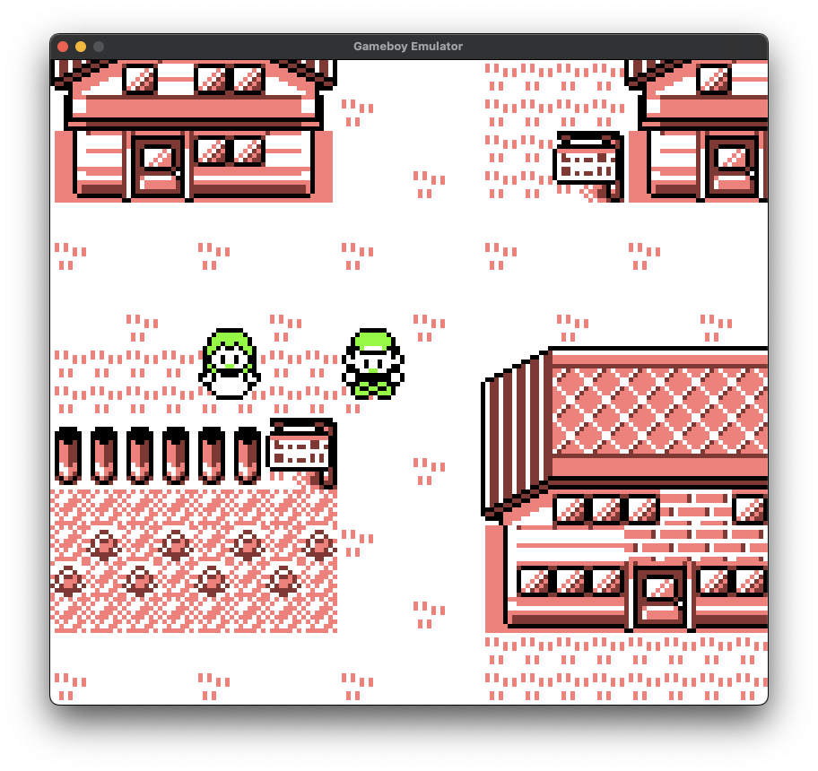
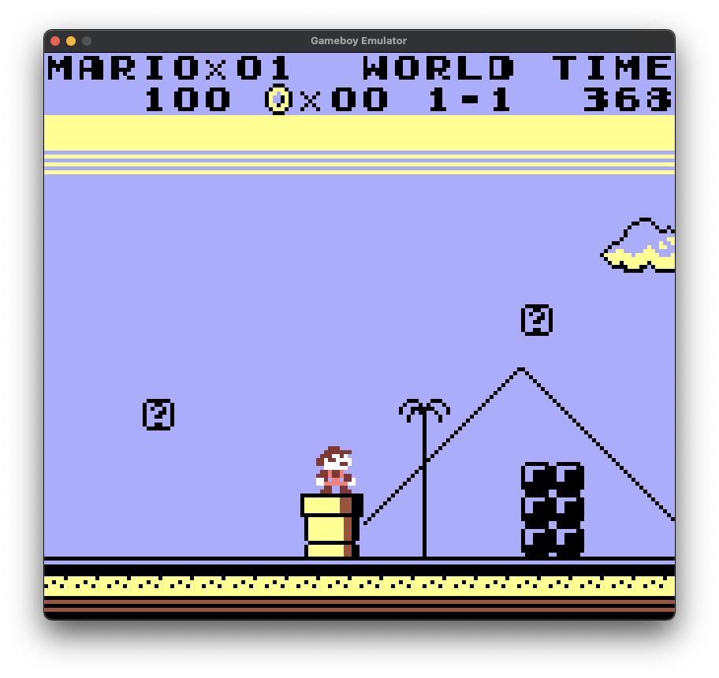
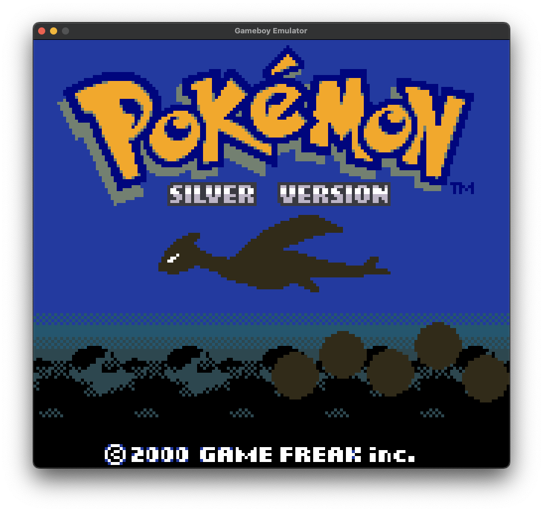

# Gameboy Emulator

Game Boy (DMG) and Game Boy Color (CGB) emulator written from scratch in Rust. It uses SDL2 to handle user input and create windows. Most features of CGB work, but HDMA is not fully implemented.

<!--    -->

  

## Getting Started

### Download

Visit the releases page and download the latest version. Currently the only binary available is for MacOS.

### Run

To include a boot rom, add a boot.bin file in the same directory as the executable. A boot rom is optional, if no boot rom is provided, then DMG games will default to black and white instead of DMG-Compatible mode. If a boot rom is found, then DMG games will run in DMG-Compatible mode.

After opening the emulator, a file dialog will open and a ROM can be selected.

### Controls

- Arrows for direction
- `Z`: A button
- `X`: B button
- `Enter`: Start button
- `RShift`: Select button
- `Escape`: Quit

### Saves

A save file can be provided or the emulator will create it's own.
Save files use the following naming convention: rom-file-name.sav

## Tested Games

- [x] Tetris
- [x] Dr. Mario
- [x] Pokemon Red
- [ ] Pokemon Silver
  - Glitch when opening start menu
- [ ] Pokemon Crystal
  - HDMA not implemented
